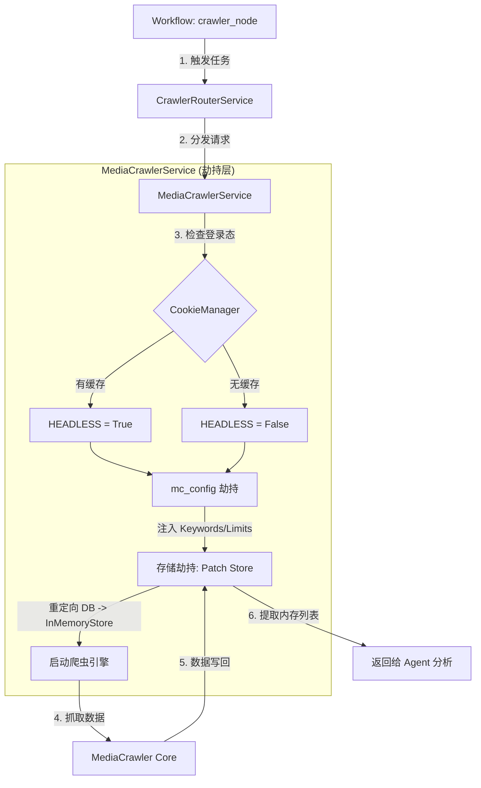

# GlobalInSight 业务流程技术文档

本项目主要由两条核心业务主线构成：**全网热点自动化扫描线** 与 **深度舆情分析发布线**。

---

## 主线一：全网热点自动化扫描 (Hot-Scan Line)
**核心目标**：自动监测全球舆情，发现跨语言、跨文化的热点话题。

### 流程图解
`定时器/前端请求` -> `多源抓取` -> `跨语言对齐` -> `LLM 摘要` -> `前端展示/历史存档`

### 详细步骤
1. **触发任务**：
    - **自动**：由 [hot_news_scheduler.py](file:///d:/python-project/GlobalInSight/app/services/hot_news_scheduler.py) 定时触发。
    - **手动**：前端调用 `/api/hot-news/sync` 接口触发。
2. **多源采集**：
    - [tophub_collector.py](file:///d:/python-project/GlobalInSight/app/services/tophub_collector.py) 抓取百度、微博、知乎、头条的热榜数据。
    - [hn_hot_collector.py](file:///d:/python-project/GlobalInSight/app/services/hn_hot_collector.py) 抓取 Hacker News 等国外技术/社会热点。
3. **话题对齐与增强**：
    - [hotnews_alignment.py](file:///d:/python-project/GlobalInSight/app/services/hotnews_alignment.py) 利用语义分析，将国内外描述同一事件的话题进行匹配。
    - [hotnews_llm_enricher.py](file:///d:/python-project/GlobalInSight/app/services/hotnews_llm_enricher.py) 调用 LLM 为对齐后的热点生成双语摘要、重要度评分和标签。
4. **持久化与反馈**：
    - [hot_news_cache.py](file:///d:/python-project/GlobalInSight/app/services/hot_news_cache.py) 将结果写入 `cache/` 目录。
    - [endpoints.py](file:///d:/python-project/GlobalInSight/app/api/endpoints.py) 将处理好的热榜列表返回给前端，供用户浏览或点击。

---

## 主线二：深度舆情分析与发布 (Analysis-Publish Line)
**核心目标**：针对特定关键词进行全网深挖，通过多 Agent 辩论生成高质量舆情报告并发布。

### 流程图解
`前端输入关键词` -> `多平台爬虫` -> `多 Agent 辩论分析` -> `媒体渲染` -> `小红书发布` -> `前端返回报告`

### 详细步骤
1. **任务发起**：
    - 用户在前端输入话题，请求 `/api/workflow/start`。
    - [endpoints.py](file:///d:/python-project/GlobalInSight/app/api/endpoints.py) 接收参数并启动 [workflow.py](file:///d:/python-project/GlobalInSight/app/services/workflow.py) 中的状态机。
2. **分布式爬取**：
    - `Workflow` 调度 `crawler_node`。
    - [crawler_router_service.py](file:///d:/python-project/GlobalInSight/app/services/crawler_router_service.py) 根据配置分发任务。
    - [media_crawler_service.py](file:///d:/python-project/GlobalInSight/app/services/media_crawler_service.py) 驱动小红书、抖音、B站等内核，利用 [cookie_manager.py](file:///d:/python-project/GlobalInSight/app/services/cookie_manager.py) 的登录态抓取原始评论和笔记。
3. **Agent 辩论分析**：
    - **Reporter**: 提取 5W1H 核心事实。
    - **Analyst**: 根据 [steering/](file:///d:/python-project/GlobalInSight/steering/) 中的提示词生成深度洞察。
    - **Debater**: 寻找分析漏洞，强制进行 1-5 轮逻辑修正。
4. **多媒体生成**：
    - [image_generator.py](file:///d:/python-project/GlobalInSight/app/services/image_generator.py) 调用 DALL-E 3 生成配图。
    - 调用 [renderer/](file:///d:/python-project/GlobalInSight/renderer/) 渲染数据可视化卡片。
5. **成果产出与发布**：
    - [xiaohongshu_publisher.py](file:///d:/python-project/GlobalInSight/app/services/xiaohongshu_publisher.py) 调用 [XHS-MCP](file:///d:/python-project/GlobalInSight/XHS-MCP/) 驱动将报告发布至小红书。
    - 最终 Markdown 报告存入 `outputs/`。
    - [workflow_status.py](file:///d:/python-project/GlobalInSight/app/services/workflow_status.py) 通过 SSE (Server-Sent Events) 向前端实时推送进度，直到任务结束返回最终 URL。

---

## MediaCrawlerService 类深度解析 (全方法伪代码)

[media_crawler_service.py](file:///d:/python-project/GlobalInSight/app/services/media_crawler_service.py) 中的 `MediaCrawlerService` 类是 Agent 的“执行手”。以下是该类所有核心方法的逻辑解析：

### 1. `_patch_store_for_platform` (存储逻辑劫持)
```python
# 方法：对爬虫进行“外科手术”，拦截本该存入数据库的数据，改存入内存
# 参数：平台名
def _patch_store_for_platform(平台):
    1. 规范化平台名 (如 "小红书" -> "xhs")
    2. 定义平台对应的【存储工厂】位置 (例如: xhs -> store.xhs.XhsStoreFactory)
    
    try:
        3. 动态加载该平台的存储模块 (importlib.import_module)
        4. 找到该模块里的 工厂类 (Factory Class)
        
        # --- [关键步骤: 掉包] ---
        5. 【保存现场】: 把原本工厂里的 create_store 方法备份起来
        
        6. 【定义假方法】: 创建一个永远只返回 self.in_memory_store 的静态方法
        
        7. 【执行掉包】: 用假方法替换掉工厂里的原方法
        
        8. 返回备份的原方法 (方便以后还原)
        
    except 异常:
        打印警告并返回 None
```

### 2. `crawl_platform` (核心抓取执行引擎)
```python
# 方法：执行单个平台的抓取全流程
# 参数：平台, 关键词, 数量, 超时时间
async def crawl_platform(平台, 关键词, 数量, 超时):
    1. 规范化平台名
    2. 【清空】内存存储空间 (为本次任务做准备)
    3. 【拦截开始】: 调用 _patch_store_for_platform 劫持存储逻辑
    
    try:
        # --- [环境注入] ---
        4. 使用 _configure_mediacrawler 上下文管理器:
            - 注入配置 (关键词、数量、是否静默运行等)
            - 此时 mc_config 已经被修改
            
        5. 【实例化】: 调用爬虫工厂创建对应平台的 crawler 实例
        
        6. 【启动任务】: 
           try:
               执行 await crawler.start()，并加上超时限制
               
               # --- [登录态自动续期] ---
               7. 抓取成功后，检查 crawler 对象里的浏览器上下文 (browser_context)
               8. 如果能拿到最新的 Cookies:
                  - 调用 cookie_manager 将其保存到 cookies.json
                  - 这样下次运行就能直接“静默登录”
                  
           except 超时:
               打印超时警告
           except 进程退出 (SystemExit):
               捕获微博等平台登录失败的杀进程行为，改为打印警告
               
        9. 【收尾】: 显式关闭浏览器上下文，释放内存
        
        10. 【标准化】: 将内存中抓到的原始数据，通过 _standardize_item 转为统一格式
        
        11. 返回标准化后的数据列表

    finally:
        12. 【还原现场】: 把之前掉包的存储工厂方法换回去，确保不影响其他任务
```

### 3. `crawl_multiple_platforms` (并发指挥官)
```python
# 方法：同时启动多个平台的抓取任务
# 参数：平台列表, 关键词, 数量, 并发数
async def crawl_multiple_platforms(平台列表, 关键词, 数量, 并发数):
    1. 创建一个【信号量】(Semaphore)，限制同时开启的浏览器数量 (默认2个)
    
    # 内部辅助函数: 带锁的抓取
    async def 带锁抓取(平台):
        使用 信号量 锁定:
            执行 await crawl_platform(...)
            返回 (平台名, 结果)

    2. 创建任务列表: 为列表里的每个平台创建一个“带锁抓取”任务
    
    3. 【并行启动】: 使用 asyncio.gather 同时运行所有任务
    
    4. 汇总所有平台的返回结果，打成一个字典 (平台: 数据列表)
    
    5. 返回最终字典给 Workflow
```

### 4. `_standardize_item` (数据翻译官)
```python
# 方法：将不同平台的“方言”转为系统的“普通话”
# 参数：原始数据项, 平台名
def _standardize_item(原始项, 平台):
    1. 提取 唯一ID: (不管叫 note_id 还是 aweme_id，统一叫 content_id)
    2. 提取 标题和正文
    3. 提取 作者信息: (user_id, nickname, avatar)
    4. 提取 互动数据: (点赞数、评论数、转发数)
    5. 记录 原始链接和时间戳
    6. 【保留底稿】: 将整个 raw_data 完整存入，供 AI 深入分析时使用
    
    返回 统一格式的字典
```

---
**核心逻辑**：参数动态注入 + 存储逻辑劫持

### 1. 技术流程图 (Mermaid)


### 2. 核心代码实现清单

#### **A. 状态机节点触发**
在 [workflow.py](file:///d:/python-project/GlobalInSight/app/services/workflow.py) 中，Agent 将任务下发给路由：
```python
# 核心代码片段
results = await crawler_router_service.crawl_platform(
    platform=p,
    keywords=topic,
    max_items=max_items
)
```

#### **B. 全局配置劫持**
在 [media_crawler_service.py](file:///d:/python-project/GlobalInSight/app/services/media_crawler_service.py) 中，通过上下文管理器动态修改爬虫内核的 `config.py`：
```python
# _configure_mediacrawler 核心逻辑
import config as mc_config
mc_config.PLATFORM = platform
mc_config.KEYWORDS = keywords
mc_config.CRAWLER_MAX_NOTES_COUNT = max_items
mc_config.HEADLESS = True if has_login_state else False
```

#### **C. 存储逻辑劫持 (Store Patching)**
这是最精妙的部分，防止爬虫产生本地垃圾文件，将数据直接拦截到内存：
```python
# _patch_store_for_platform 核心逻辑
def _patch_store_for_platform(self, platform: str, store: InMemoryStore):
    import store.xhs as xhs_store # 以小红书为例
    # 强行替换底层保存函数
    xhs_store.update_xhs_note = store.add_note 
    xhs_store.batch_update_xhs_note_comments = store.add_comments
```

### 3. 关键配置项说明

| 配置文件 | 关键参数 | 作用说明 |
| :--- | :--- | :--- |
| `app/config.py` | `CRAWLER_LIMITS` | **Agent 控制阀**：决定每个平台抓取数据的上限。 |
| `app/config.py` | `MEDIA_CRAWLER_PATH` | **路径指引**：定位爬虫内核代码所在目录。 |
| `MediaCrawler/config.py` | `ENABLE_IP_PROXY` | **反爬配置**：是否启用代理 IP 池。 |
| `MediaCrawler/config.py` | `CRAWLER_MAX_SLEEP_SEC` | **频率控制**：模拟真人操作的随机睡眠时间上限。 |

---

| 文件夹/文件 | 所属主线 | 核心职责 |
| :--- | :--- | :--- |
| `app/api/` | 共有 | 定义 RESTful API，接收前端指令 |
| `app/services/workflow.py` | 主线二 | AI Agent 的思维导图与执行引擎 |
| `app/services/tophub_collector.py` | 主线一 | 全网热榜数据的“搬运工” |
| `app/services/media_crawler_service.py`| 主线二 | 社交媒体底层数据的“采集员” |
| `app/services/image_generator.py` | 主线二 | 舆情海报与 AI 配图的“设计师” |
| `app/services/cookie_manager.py` | 共有 | 负责所有平台的“身份通行证”管理 |
| `XHS-MCP/` | 主线二 | 最终成果发布到小红书的“执行官” |

---

## 核心文件深度解析：media_crawler_service.py

[media_crawler_service.py](file:///d:/python-project/GlobalInSight/app/services/media_crawler_service.py) 是连接 **Agent 决策层** 与 **爬虫执行层** 的核心桥梁。它不仅负责启动爬虫，更通过“代码注入”技术实现了对第三方库的深度控制。

### 1. 核心职责描述
- **配置环境对齐**：将 Agent 传入的关键词、平台、条数等参数，实时注入到 MediaCrawler 的全局配置中。
- **登录态智能管理**：自动检测 `browser_data` 缓存和 `CookieManager`，决定是“静默后台运行”还是“弹出窗口扫码”。
- **数据流拦截（劫持）**：屏蔽爬虫原有的数据库/文件保存逻辑，将抓取到的原始数据拦截并重定向到内存中，供 AI 即时分析。

### 2. 关键方法解析

#### **A. `crawl_platform` (入口方法)**
- **作用**：这是被外部调用的唯一公开接口。
- **逻辑**：
    1. 规范化平台名称（如 `xhs`）。
    2. 使用 `_configure_mediacrawler` 上下文管理器初始化环境。
    3. 检查本地是否有 `xhs_user_data_dir` 等文件夹，决定 `HEADLESS` 模式。
    4. 启动异步爬虫任务并捕获可能的超时或崩溃异常。

#### **B. `_configure_mediacrawler` (环境上下文)**
- **作用**：确保爬虫库在运行时的参数是正确的。
- **逻辑**：
    - 在 `__enter__` 时备份原始配置，注入新参数。
    - 在 `__exit__` 时恢复现场，确保多轮分析之间互不干扰。

#### **C. `_patch_store_for_platform` (存储劫持核心)**
- **作用**：将爬虫“改造”为 Agent 专用的内存模式。
- **逻辑**：
    - 动态导入（`importlib`）对应平台的 `store` 模块。
    - 将 `xhs_store.update_xhs_note` 等函数指针替换为自定义 `InMemoryStore` 的 `add_note` 方法。
    - **意义**：这是实现“阅后即焚”和“极速分析”的技术基础。

#### **D. `_get_platform_crawler` (驱动工厂)**
- **作用**：根据平台名称动态实例化对应的 Crawler 类（如 `XiaoHongShuCrawler`, `DouYinCrawler`）。

### 3. 设计模式亮点
- **单例模式**：通过 `crawler_service = MediaCrawlerService()` 确保全局只有一个爬虫管理器，避免并发冲突。
- **策略模式**：根据不同的平台字符串，动态路由到不同的抓取策略和存储劫持逻辑。
- **异常隔离**：通过捕获 `SystemExit` 和 `Exception`，确保单个平台（如微博）的登录失败不会导致整个 AI Agent 系统挂掉。
