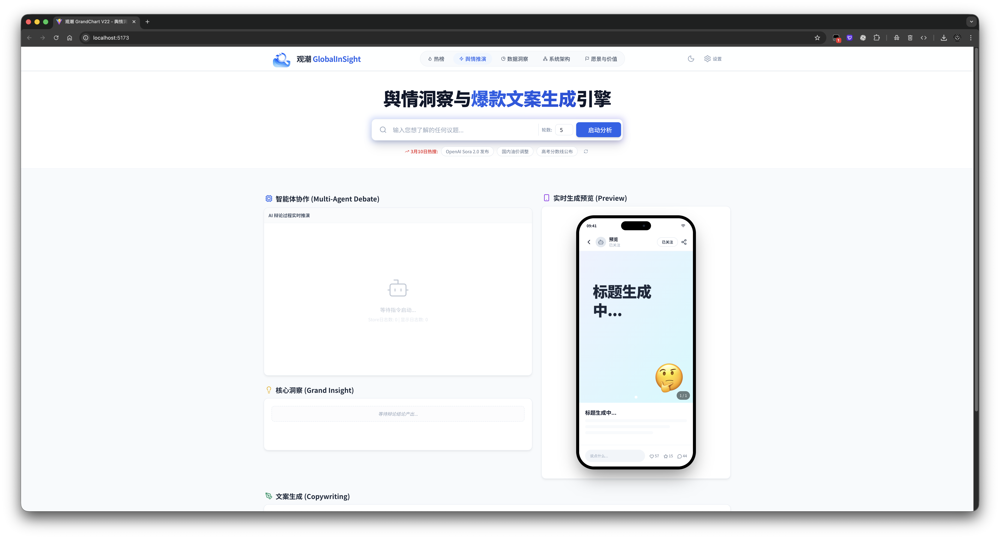
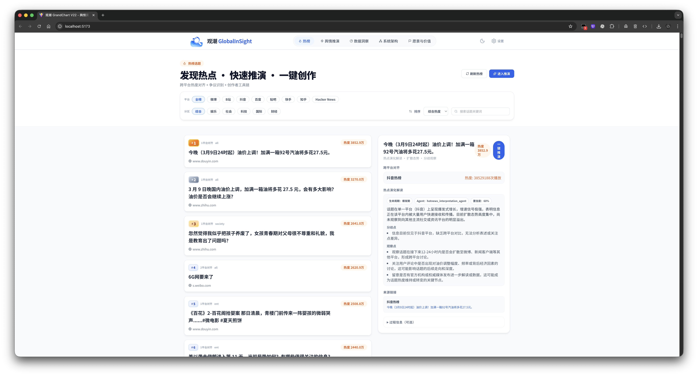
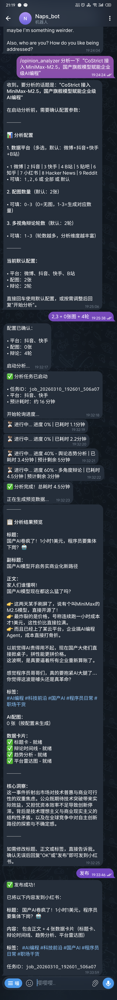

# GlobalInSight - 多阶段舆情解读与热点对齐系统

> ⚠️ **测试版 (Beta)** - 本项目仍在积极开发中，功能可能不稳定，API 可能变更

<p align="center">
  <a href="#快速开始">快速开始</a> ·
  <a href="#核心功能">核心功能</a> ·
  <a href="#典型工作流">典型工作流</a> ·
  <a href="#使用方式推荐演示路径">使用方式</a> ·
  <a href="#opinion-mcp-服务-openclaw--clawdbot-深度集成">OpenClaw 集成</a> ·
  <a href="#常见问题">FAQ</a>
</p>


## 项目名称
**GlobalInSight：多阶段舆情解读与热点对齐系统**

## 版本信息
- **当前版本**：v0.9.0-beta
- **更新日期**：2026-01-28
- **状态**：🧪 测试版

## 项目简介

GlobalInSight 是一个围绕 **“热点发现 → 多平台采集 → 多阶段舆情解读 → 结果可视化 → 小红书发布”** 打通的端到端系统。

它不是单一的爬虫工具，也不是单一的内容生成器，而是把热点监测、跨平台信息汇总、LLM 推理、多视角辩论、图文生成与发布流程连接成一个完整工作流，帮助你更快地把“值得跟进的话题”转化为“可以交付的内容结果”。

## 为什么是 GlobalInSight

- **不是只看热榜，而是直接进入可执行工作流**：从发现热点到生成可发布内容，中间链路完整可追踪。
- **不是单平台视角，而是跨平台舆论拼接**：支持小红书、抖音、快手、B站、微博、贴吧、知乎等数据源。
- **不是一次性摘要，而是多阶段推理**：支持事实提炼、态势分析、观点辩论、文案生成与配图生成。
- **不是只能点网页，而是支持对话式调用**：已可通过 OpenClaw 作为自然语言入口，以 MCP 方式接入完整分析与发布能力。
- **不是拼凑脚本，而是前后端一体化系统**：提供 Web UI、后端 API、MCP 服务与第三方能力集成。

## 运行环境
- **Python**：3.9+（推荐 3.10 或 3.11）
- **Node.js**：16+（推荐 18+）
- **包管理**：pip / npm
- **操作系统**：macOS / Linux / Windows 10/11
- **依赖版本要求**：
  - fastapi >= 0.110.0
  - pydantic >= 2.5.0
  - uvicorn >= 0.27.0
- **支持 Node.js 版本管理工具**：fnm、nvm、nvm-windows

## 核心功能

| 功能 | 描述 | 状态 |
|------|------|------|
| 🔍 多平台热点采集 | 小红书、抖音、快手、B站、微博、贴吧、知乎 | ✅ 稳定 |
| 📊 热榜聚合 | TopHub + HackerNews 热榜数据 | ✅ 稳定 |
| 🤖 LLM 多阶段解读 | 热点对齐、演化分析、内容生成 | ✅ 稳定 |
| 🖼️ AI 图片生成 | 火山引擎 Volcengine 配图 | ✅ 稳定 |
| 📱 小红书发布 | 一键发布到小红书 | ✅ 稳定 |
| 💬 OpenClaw 集成 | 对话式分析与发布入口 | ✅ 已集成 |
| 📈 数据可视化 | 热度对比、关键词云、情感分析 | ✅ 稳定 |

## 适用场景

- **热点内容运营**：快速判断一个话题是否值得跟进，并生成适合发布的内容草稿。
- **品牌 / 行业舆情跟踪**：聚合同一议题在多个平台上的反馈，减少单平台偏差。
- **研究与演示**：将复杂舆情分析流程可视化，适合 demo、汇报和内部验证。
- **AI 对话式操作**：通过 OpenClaw 直接发起分析、查看进度、修改文案并发布。

## 典型工作流

```text
发现热点 / 输入议题
        ↓
多平台数据采集与热榜聚合
        ↓
LLM 多阶段处理（提炼 / 对齐 / 辩论 / 生成）
        ↓
生成文案、卡片、配图与数据可视化
        ↓
Web UI 预览或通过 OpenClaw 对话式调用
        ↓
发布到小红书
```


## 快速开始

### 快速启动脚本入口（推荐）

如果你已经完成下面的安装步骤，后续日常开发更推荐直接使用 `scripts/` 目录里的启动脚本，而不是每次手动输入一长串命令。

```bash
# 启动后端 API（FastAPI, 8000）
./scripts/start-backend.sh

# 启动前端开发服务器（Vite, 5173）
./scripts/start-frontend.sh

# 启动 Opinion MCP（18061）
./scripts/start-opinion-mcp.sh

# 启动卡片渲染服务（3001）
./scripts/start-renderer.sh

# 启动小红书 MCP（18060）
./scripts/start-xhs-mcp.sh
```

如需先完成爬虫/平台登录，也可以使用：

```bash
# 默认登录小红书，也可替换为 dy / ks / wb / bili / tieba / zhihu
./scripts/start-crawler-login.sh xhs
```

> 说明：以上脚本是对下方安装与启动命令的封装入口，便于日常开发使用；**下面的原始安装步骤仍然保留，且仍然是完整、已验证的权威流程**。

### 1. 克隆项目

```bash
git clone <repository-url>
cd GlobalInSight
```

#### 2. 小红书 MCP 服务设置（必须）

本项目的小红书发布功能依赖外部 MCP 服务，请先完成以下设置：

##### 2.1 下载 MCP 服务程序

根据您的系统架构选择对应版本：

**macOS:**
```bash
# Apple Silicon (M1/M2/M3)
mkdir -p external/XHS-MCP/xiaohongshu-mcp-darwin-arm64
curl -L -o external/XHS-MCP/xiaohongshu-mcp-darwin-arm64/xiaohongshu-mcp-darwin-arm64 https://github.com/xpzouying/xiaohongshu-mcp/releases/latest/download/xiaohongshu-mcp-darwin-arm64
curl -L -o external/XHS-MCP/xiaohongshu-mcp-darwin-arm64/xiaohongshu-login-darwin-arm64 https://github.com/xpzouying/xiaohongshu-mcp/releases/latest/download/xiaohongshu-login-darwin-arm64

# Intel
mkdir -p external/XHS-MCP/xiaohongshu-mcp-darwin-amd64
curl -L -o external/XHS-MCP/xiaohongshu-mcp-darwin-amd64/xiaohongshu-mcp-darwin-amd64 https://github.com/xpzouying/xiaohongshu-mcp/releases/latest/download/xiaohongshu-mcp-darwin-amd64
curl -L -o external/XHS-MCP/xiaohongshu-mcp-darwin-amd64/xiaohongshu-login-darwin-amd64 https://github.com/xpzouying/xiaohongshu-mcp/releases/latest/download/xiaohongshu-login-darwin-amd64

# 设置可执行权限
chmod +x external/XHS-MCP/xiaohongshu-mcp-darwin-*/xiaohongshu-mcp-darwin-*
chmod +x external/XHS-MCP/xiaohongshu-mcp-darwin-*/xiaohongshu-login-darwin-*
```

**Windows:**
```cmd
REM 创建目录
mkdir external\XHS-MCP\xiaohongshu-mcp-windows-amd64

REM 下载文件（使用 PowerShell）
powershell -Command "Invoke-WebRequest -Uri 'https://github.com/xpzouying/xiaohongshu-mcp/releases/latest/download/xiaohongshu-mcp-windows-amd64.exe' -OutFile 'external\XHS-MCP\xiaohongshu-mcp-windows-amd64\xiaohongshu-mcp-windows-amd64.exe'"
powershell -Command "Invoke-WebRequest -Uri 'https://github.com/xpzouying/xiaohongshu-mcp/releases/latest/download/xiaohongshu-login-windows-amd64.exe' -OutFile 'external\XHS-MCP\xiaohongshu-mcp-windows-amd64\xiaohongshu-login-windows-amd64.exe'"
```

##### 2.2 首次登录小红书（必须）

**macOS:**
```bash
# 进入 external/XHS-MCP 目录
cd external/XHS-MCP/xiaohongshu-mcp-darwin-arm64  # 或 darwin-amd64

# 运行登录工具获取 cookie
./xiaohongshu-login-darwin-arm64  # 或 darwin-amd64

# 程序会打开浏览器窗口，扫码登录小红书
# 登录成功后关闭窗口，程序会自动保存登录状态到 cookies.json

# 返回项目根目录
cd ../..
```

**Windows:**
```cmd
REM 进入 external/XHS-MCP 目录
cd external\XHS-MCP\xiaohongshu-mcp-windows-amd64

REM 运行登录工具
xiaohongshu-login-windows-amd64.exe

REM 程序会打开浏览器窗口，扫码登录小红书
REM 登录成功后关闭窗口，程序会自动保存登录状态到 cookies.json

REM 返回项目根目录
cd ..\..
```

##### 2.3 启动 MCP 服务（保持运行）

**macOS:**
```bash
# 在新的终端窗口中启动服务（默认端口 18060）
cd external/XHS-MCP/xiaohongshu-mcp-darwin-arm64  # 或 darwin-amd64
./xiaohongshu-mcp-darwin-arm64  # 或 darwin-amd64

# 验证服务是否正常运行（在另一个终端窗口）
curl http://localhost:18060/mcp
```

**Windows:**
```cmd
REM 在新的命令行窗口中启动服务（默认端口 18060）
cd external\XHS-MCP\xiaohongshu-mcp-windows-amd64
xiaohongshu-mcp-windows-amd64.exe

REM 验证服务是否正常运行（在另一个命令行窗口）
curl http://localhost:18060/mcp
```

**重要提示**：
- 首次运行时可能会自动下载无头浏览器（约 150MB），请耐心等待
- MCP 服务需要在后台保持运行，建议新开一个终端窗口
- 如果发布失败提示未登录，请重新运行步骤 2.2 的登录工具
- 详细文档：[XHS_SETUP.md](docs/XHS_SETUP.md)

#### 3. 后端设置

**macOS / Linux:**
```bash
# 创建虚拟环境
python3 -m venv .venv

# 激活虚拟环境
source .venv/bin/activate

# 安装依赖
pip install -r requirements.txt

# 配置环境变量(可选)
cp .env.example .env
# 编辑 .env 文件，填入你的 API Keys

# 安装 Playwright 浏览器（用于爬虫）
playwright install chromium

# 启动后端服务
python -m app.main
```

**Windows:**
```cmd
REM 创建虚拟环境
python -m venv .venv

REM 激活虚拟环境
.venv\Scripts\activate.bat

REM 安装依赖
pip install -r requirements.txt

REM 配置环境变量(可选)
copy .env.example .env
REM 编辑 .env 文件，填入你的 API Keys

REM 安装 Playwright 浏览器（用于爬虫）
playwright install chromium

REM 启动后端服务
python -m app.main
```

后端服务将在 `http://localhost:8000` 启动
- API 文档：`http://localhost:8000/docs`
- API 前缀：`/api`

#### 4. 前端设置

```bash
# 安装依赖
cd frontend
npm install

# 启动开发服务器
npm run dev
```

前端服务将在 `http://localhost:5173` 启动

#### 5. 首次使用配置

1. 打开浏览器访问 `http://localhost:5173`
2. 进入"设置"页面
3. 添加你的 LLM API Keys（可选，未配置则使用后端 .env 中的密钥）
4. 选择要启用的平台（可选，默认启用所有平台）
5. 配置热榜和图片生成服务（可选）
6. 点击"测试小红书 MCP 连接"按钮，确保 MCP 服务正常运行

**注意**：
- API Keys 会保存在浏览器本地缓存和后端配置中
- 如需清除所有设置，点击设置页面右上角的"清除缓存"按钮
- 切换到新环境时，建议先清除缓存后重新配置

## 建议补充的 README 截图位







<details>
<summary>查看 OpenClaw（TG）页面截图（长图）</summary>

[](docs/assets/Openclaw_page.png)

</details>


## 使用方式（推荐演示路径）

- **首页（Home）**：输入议题 → 启动分析 → 观察 SSE 实时日志 → 查看预览页面 → 一键发布小红书
- **热榜页（HotView）**：刷新热榜 → 切换平台 → 点选单条热点生成"演化解读卡"
- **数据页（DataView）**：切换数据源（workflow/hotnews）→ 查看"平台热度对比 / 关键词 / 情感等"图表

## 部署生产环境

```bash
# 前端构建
cd frontend && npm run build

# 后端使用 gunicorn 部署
pip install gunicorn
gunicorn app.main:app -w 4 -k uvicorn.workers.UvicornWorker --bind 0.0.0.0:8000
```

## 项目结构说明
- `app/`：后端（FastAPI、LLM Agent、爬虫/热榜、对齐聚类、缓存）
  - `services/`：核心服务（爬虫、LLM、热榜收集器等）
  - `api/`：API 端点定义
  - `config.py`：配置管理
- `frontend/`：前端（Vue3、Pinia、Tailwind、图表与可视化）
  - `src/`：Vue 源码
    - `views/`：页面组件
    - `stores/`：Pinia 状态管理
    - `api/`：API 调用封装
  - `renderer/`：卡片渲染服务（Express + Playwright）
- `docs/`：项目文档
  - `project/`：项目相关文档
  - `steering/`：Agent 行为指南
- `external/MediaCrawler/`：第三方爬虫库（已集成到项目中）
- `external/XHS-MCP/`：小红书 MCP 服务二进制文件

## 架构速览

```text
前端 Web UI (Vue3)
        ↓
FastAPI 后端 / 任务编排 / LLM 服务
        ↓
数据采集层（MediaCrawler / 热榜聚合 / 平台服务）
        ↓
结果生成层（文案 / 卡片 / 图片 / 可视化）
        ↓
发布层（xiaohongshu-mcp）

并行能力：
OpenClaw  ←→  Opinion MCP Server  ←→  GlobalInSight
```

### 架构理解重点

- **Web UI** 适合人工观察、调参、演示与可视化查看。
- **后端服务** 负责统一编排采集、推理、生成与发布链路。
- **Opinion MCP** 负责把核心能力暴露给支持 MCP 的 AI 客户端。
- **小红书 MCP** 作为发布层能力接入，保持单独运行但已在系统流程中打通。

## 常见问题

### Q: 依赖安装失败？
A: 确保 Python 版本 >= 3.9，并且已安装 fastapi >= 0.110.0 和 pydantic >= 2.5.0。如果还有问题，尝试升级 pip：`pip install --upgrade pip`

### Q: 更换设备后仍显示旧的 API Keys？
A: 这是浏览器缓存导致的。点击设置页面右上角的"清除缓存"按钮即可。

### Q: Playwright 安装失败？
A: 运行 `playwright install --with-deps chromium` 安装浏览器及其依赖。

### Q: 小红书 MCP 服务连接失败？
A: 
1. 确保 MCP 服务正在运行（步骤 2.3）
2. 检查端口 18060 是否被占用
3. 重新运行登录工具（步骤 2.2）
4. 查看 MCP 服务的终端输出日志

### Q: 安装时出现"路径过长"错误？
A: Windows 默认有 260 字符的路径长度限制。解决方法：

**启用 Windows 长路径支持**（推荐）：
1. **以管理员身份打开 PowerShell**
   - 按 `Win + X` → 选择 "Windows PowerShell (管理员)" 或 "终端 (管理员)"

2. **运行命令**
   ```powershell
   New-ItemProperty -Path "HKLM:\SYSTEM\CurrentControlSet\Control\FileSystem" -Name "LongPathsEnabled" -Value 1 -PropertyType DWORD -Force
   ```
   
   如果提示已存在，使用：
   ```powershell
   Set-ItemProperty -Path "HKLM:\SYSTEM\CurrentControlSet\Control\FileSystem" -Name "LongPathsEnabled" -Value 1 -Force
   ```

3. **验证设置**
   ```powershell
   Get-ItemProperty -Path "HKLM:\SYSTEM\CurrentControlSet\Control\FileSystem" -Name "LongPathsEnabled"
   ```

4. **重启电脑**（必须）

5. **重启后重新安装**
   ```powershell
   pip uninstall volcengine-python-sdk -y
   pip cache purge
   pip install -r requirements.txt
   ```

### Q: 端口被占用？
A: 修改 `app/main.py` 中的端口配置，或使用环境变量 `PORT=8080 python -m app.main`

## 交付物建议打包方式
- **Project_SourceCode**：直接将整个项目目录压缩为 zip（包含本 README）
- **Project_Documentation**：见 `docs/project/` 目录（可导出为 PDF）

---

## 📦 集成的开源项目

本项目集成了以下优秀的开源项目，在此表示衷心感谢：

### 1. MediaCrawler - 自媒体平台爬虫

**项目地址**：[https://github.com/NanmiCoder/MediaCrawler](https://github.com/NanmiCoder/MediaCrawler)

**简介**：功能强大的多平台自媒体数据采集工具，支持小红书、抖音、快手、B站、微博、贴吧、知乎等主流平台的公开信息抓取。

**集成说明**：MediaCrawler 已完整集成到本项目的 `external/MediaCrawler/` 目录中，无需额外安装。项目启动时会自动使用集成的爬虫功能。

**如需单独使用 MediaCrawler**：

```bash
# 进入 MediaCrawler 目录
cd external/MediaCrawler

# 安装 uv（如果尚未安装）
# macOS/Linux:
curl -LsSf https://astral.sh/uv/install.sh | sh
# Windows: 访问 https://docs.astral.sh/uv/getting-started/installation

# 使用 uv 同步依赖
uv sync

# 安装浏览器驱动
uv run playwright install

# 运行爬虫（以小红书为例）
uv run main.py --platform xhs --lt qrcode --type search

# 查看更多平台和选项
uv run main.py --help

# 启动 WebUI（可选）
uv run uvicorn api.main:app --port 8080 --reload
# 访问 http://localhost:8080
```

**配置说明**：
- 配置文件：`external/MediaCrawler/config/base_config.py`
- 支持数据存储：CSV、JSON、Excel、SQLite、MySQL
- 完整文档：[MediaCrawler 文档](https://nanmicoder.github.io/MediaCrawler/)

---

### 2. xiaohongshu-mcp - 小红书 MCP 服务

**项目地址**：[https://github.com/xpzouying/xiaohongshu-mcp](https://github.com/xpzouying/xiaohongshu-mcp)

**简介**：基于 Model Context Protocol (MCP) 的小红书发布服务，支持自动发布内容到小红书平台。

**集成说明**：本项目依赖 xiaohongshu-mcp 服务实现小红书内容发布功能。该服务需要独立运行，请参考"快速开始"第 2 步完成设置。

**注意事项**：
- MCP 服务必须在后台保持运行
- 首次使用需要扫码登录小红书
- 登录状态保存在 `cookies.json` 文件中
- 详细文档：[XHS_SETUP.md](docs/XHS_SETUP.md)

---

## 🤖 Opinion MCP 服务 (OpenClaw / ClawdBot 深度集成)

Opinion MCP 是 GlobalInSight 面向 **OpenClaw / ClawdBot** 的对话式能力入口。它基于 Model Context Protocol (MCP) 暴露系统能力，已经可以把 **舆论分析、热榜获取、结果查询、文案修改与小红书发布** 接入到 OpenClaw / ClawdBot 的对话工作流中。

换句话说：OpenClaw / ClawdBot 不再只是“外部调用方”，而是已经作为 GlobalInSight 的自然语言操作入口完整接入，可以直接驱动分析、预览与发布链路。

### 集成价值

- **一句话发起分析**：无需先打开页面逐项点击配置。
- **任务进度可回推**：分析过程中可持续获得状态更新。
- **结果预览后再发布**：支持先审阅文案，再决定是否发布到小红书。
- **适合嵌入现有 AI 工作流**：便于接入支持 MCP 的客户端或 Agent 系统。

### 功能特点

- **话题舆论分析**：分析指定话题在多平台的舆论态势
- **热榜数据获取**：获取多平台热点新闻聚合
- **进度实时推送**：通过 Webhook 推送分析进度
- **文案编辑**：支持修改生成的小红书文案
- **一键发布**：直接发布到小红书平台
- **防重复发布**：自动检测并阻止重复发布同一任务

### 启动 Opinion MCP 服务

```bash
# 方式 1: 使用启动脚本
./scripts/start-opinion-mcp.sh

# 方式 2: 直接运行
source .venv/bin/activate
python -m app.opinion_mcp.server --port 18061

# 验证服务是否正常运行
curl http://localhost:18061/health
```

### 可用工具

| 工具名称 | 描述 |
|---------|------|
| `analyze_topic` | 启动舆论分析任务，支持指定平台、图片数量、辩论轮次 |
| `get_analysis_status` | 查询舆论分析任务的当前状态和进度 |
| `get_analysis_result` | 获取已完成的舆论分析结果，包含文案和配图 |
| `get_hot_news` | 获取多平台热榜数据，可用于发现热门话题 |
| `get_settings` | 获取当前的分析配置，包括默认平台、图片数量等 |
| `update_copywriting` | 修改分析结果的文案内容 |
| `publish_to_xhs` | 将分析结果发布到小红书（含防重复机制） |
| `register_webhook` | 注册进度推送的 Webhook URL |

### OpenClaw 用法

详细集成文档请参考：[ClawdBot / OpenClaw 集成指南](docs/CLAWDBOT_MCP_INTEGRATION.md)

1. 启动 `Opinion MCP` 服务，确保本地地址为 `http://localhost:18061`
2. 将下面 3 个 skill 文件夹整体复制到 OpenClaw 对应的 skills 目录

```bash
docs/clawdbot-skill/opinion-hot-news/
docs/clawdbot-skill/opinion-topic-analysis/
docs/clawdbot-skill/xhs-publisher/
```

3. 确认 OpenClaw 的 MCP 运行时已绑定 `opinion-analyzer`
   - `mcporter / ClawdBot`: `http://localhost:18061`
   - 原生 MCP SSE: `http://localhost:18061/sse`
4. 重新打开 OpenClaw 会话或触发 skills reload

这 3 个 skill 都是单文件平铺版，运行时不依赖额外的 `references/`。

### 推荐的对话式体验

你可以把 OpenClaw / ClawdBot 视为这个系统的“自然语言控制台”：

1. 用户描述想分析的话题
2. OpenClaw 调用 `analyze_topic` 发起任务
3. 系统通过状态查询 / Webhook 持续反馈进度
4. 用户查看结果摘要、文案和卡片预览
5. 用户确认后调用 `publish_to_xhs` 完成发布

这种方式非常适合演示、内容运营协作以及把分析流程嵌入到已有 AI 助手工作流中。

### 推荐入口

- `opinion-hot-news`: 查看今日热点 / 热榜
- `opinion-topic-analysis`: 分析明确话题、生成文案和卡片
- `xhs-publisher`: 发布已有分析结果到小红书

### 使用示例

在 OpenClaw / ClawdBot 中的典型用法：

```
/opinion-topic-analysis 分析一下 "DeepSeek开源" 这个话题

OpenClaw: 好的！请告诉我：
  1️⃣ 爬取哪些平台？(1-7 或 all)
  2️⃣ 生成几张图？(1-9)
  3️⃣ 辩论几轮？(1-5)
  
  示例回复: "1,2,6 + 3张图 + 3轮"

用户: 全部 + 3张图 + 3轮

OpenClaw: 收到！开始分析，预计需要15分钟...
  🔄 开始多平台数据爬取...
  ✅ 微博爬取完成 (45条)
  ✅ 抖音爬取完成 (32条)
  ...
  🎉 分析完成！

  📱 小红书文案预览
  标题: DeepSeek开源：中国AI的里程碑时刻
  ...

用户: OK，发布吧

OpenClaw: ✅ 发布成功！
```

### 端口说明

| 服务 | 端口 | 说明 |
|------|------|------|
| 后端 API | 8000 | FastAPI 后端服务 |
| 前端 | 5173 | Vue 开发服务器 |
| 小红书 MCP | 18060 | 小红书发布服务 |
| Opinion MCP | 18061 | 舆论分析 MCP 服务 |

---

## 🙏 鸣谢

感谢以下开源项目和开发者的贡献：

### 核心依赖项目
- **[MediaCrawler](https://github.com/NanmiCoder/MediaCrawler)** by [@NanmiCoder](https://github.com/NanmiCoder) - 强大的多平台自媒体数据采集工具
- **[xiaohongshu-mcp](https://github.com/xpzouying/xiaohongshu-mcp)** by [@xpzouying](https://github.com/xpzouying) - 小红书 MCP 发布服务

### 技术栈
- **[FastAPI](https://fastapi.tiangolo.com/)** - 现代化的 Python Web 框架
- **[Vue 3](https://vuejs.org/)** - 渐进式 JavaScript 框架
- **[Playwright](https://playwright.dev/)** - 浏览器自动化框架
- **[Pinia](https://pinia.vuejs.org/)** - Vue 状态管理库
- **[Tailwind CSS](https://tailwindcss.com/)** - 实用优先的 CSS 框架

### 特别感谢
- MediaCrawler 项目提供的稳定爬虫基础设施
- xiaohongshu-mcp 项目实现的小红书发布能力
- 所有为开源社区做出贡献的开发者们

---

## 📄 许可证

本项目采用 MIT 许可证。集成的开源项目遵循其各自的许可证：
- MediaCrawler: Apache License 2.0
- xiaohongshu-mcp: 请查看其项目仓库

## ⚠️ 免责声明

本项目仅供学习和研究使用。使用本项目进行的任何操作，用户需自行承担相关责任。请遵守相关平台的使用条款和法律法规。

## 📮 联系方式

如有问题或建议，欢迎通过以下方式联系：
- 提交 Issue
- 发起 Pull Request
- 邮件联系项目维护者

---

> 📅 最后更新：2026-01-28  
> 🏷️ 版本：v0.9.0-beta
